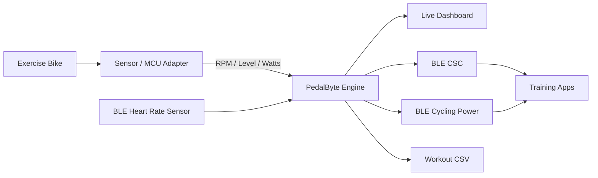

# PedalByte

Turn an ordinary exercise bike into a Bluetooth smart bike.

PedalByte is an open hardware/software bridge that takes telemetry from a conventional stationary exercise bike and exposes it as standard Bluetooth Cycling Speed & Cadence and Cycling Power data.

The project is intentionally bike-agnostic. The prototype was developed on a conventional magnetic-resistance bike, but the software boundary is a generic MCU-to-host telemetry protocol. Adapt the sensor interface and calibration to your own bike.

> **Status:** working prototype. The desktop BLE peripheral targets macOS/CoreBluetooth. Estimated power depends on bike-specific calibration and should not be treated as laboratory-grade power-meter data.

## Architecture



## Features

- Cadence from reed, Hall, encoder, or console pulse signals.
- Optional resistance level input.
- Measured or calibrated estimated power.
- Configurable virtual speed/distance model.
- Standard BLE Cycling Speed & Cadence service.
- Standard BLE Cycling Power service.
- Generic BLE Heart Rate Service client.
- Live desktop dashboard and CSV workout logging.
- Runtime configuration without editing source code.

## Hardware concept

```text
[Flywheel / Crank]
       |
       +--> Reed / Hall / Encoder --> MCU
       |
[Resistance / Console Signal] -----> MCU
                                      |
                               Serial telemetry
                                      |
                                      v
                                PedalByte host
                                      |
                         +------------+------------+
                         |                         |
                    BLE Cadence               BLE Power
                         |                         |
                         +------------+------------+
                                      |
                              Zwift / MyWhoosh /
                              compatible apps
```

### Minimum hardware

- Any stationary exercise bike with a usable cadence signal, or a sensor you can add.
- Arduino-class MCU, ESP32, or similar controller.
- USB/serial connection to the host during the current prototype stage.
- Optional BLE heart-rate sensor.

The mounting, wiring, cadence pulse count, resistance mapping, and power calibration are intentionally left bike-specific.

## Serial telemetry contract

The desktop bridge currently accepts one simple line format:

```text
RPM:82.4 Level:5 Watts:147
```

Fields:

| Field | Meaning |
|---|---|
| `RPM` | Current cadence |
| `Level` | Resistance level, if available |
| `Watts` | Measured or estimated instantaneous power |

An upstream MCU can implement this protocol with very little code.

## Power model

PedalByte supports two power paths:

**Measured power:** a real power sensor supplies watts.

**Estimated power:** cadence and resistance are mapped through a bike-specific calibration model.

For non-smart exercise bikes, estimated power is usually the practical starting point. Calibrate your model against a trusted reference if you need closer agreement.

## Configuration

Settings are environment-driven so the same code can be used across different bikes and users.

```bash
export PEDALBYTE_SERIAL_PORT=/dev/cu.usbmodemXXXX
export PEDALBYTE_BAUDRATE=115200
export PEDALBYTE_VIRTUAL_DRIVE_RATIO=3.5
export PEDALBYTE_VIRTUAL_WHEEL_CIRCUMFERENCE_M=2.1
export PEDALBYTE_USER_WEIGHT_KG=70
export PEDALBYTE_USER_AGE=30
export PEDALBYTE_ZONE_LOW_BPM=118
export PEDALBYTE_ZONE_HIGH_BPM=138
```

The first parameters to recalibrate on a new bike are the cadence signal interpretation, virtual drivetrain model, and estimated-power mapping.

## Installation

The current desktop BLE implementation is tested on **macOS**.

```bash
python3 -m venv .venv
source .venv/bin/activate
pip install -r requirements.txt
```

Configure your serial adapter:

```bash
export PEDALBYTE_SERIAL_PORT=/dev/cu.usbmodemXXXX
```

Start the dashboard:

```bash
python run.py
```

Without a connected serial adapter, the application can still start, but live bike telemetry will not be available.

## Project structure

```text
PedalByte/
├── README.md
├── LICENSE
├── requirements.txt
├── .gitignore
├── run.py
└── src/
    ├── __init__.py
    ├── bike_state.py
    ├── config.py
    ├── serial_reader.py
    ├── ble_server.py
    └── main.py
```

## Making a new bike compatible

1. Detect cadence from an existing sensor/console signal or add a reed/Hall/encoder sensor.
2. Program the MCU to emit `RPM`, `Level`, and `Watts` using the serial contract.
3. Calibrate cadence so one reported revolution matches the physical crank/flywheel relationship.
4. Set the virtual drivetrain parameters for the behavior you want in training apps.
5. Build or calibrate the power model for that bike if watts are estimated.
6. Run PedalByte and pair the BLE cycling services with your training application.

No specific manufacturer, console, flywheel mass, or resistance technology is required by the software interface.

## Limitations

- The current desktop BLE peripheral implementation is macOS-specific.
- The default serial protocol assumes an external MCU adapter.
- Virtual speed is an application-facing model, not measured road speed.
- Estimated watts are only as good as the calibration model.
- BLE compatibility varies by client application and operating system.

## Roadmap

- ESP32 firmware reference implementation.
- Hardware wiring examples for common sensor types.
- Bike-specific calibration tooling.
- Cross-platform BLE peripheral support.
- More complete FTMS support where practical.

## License

MIT. See `LICENSE`.
